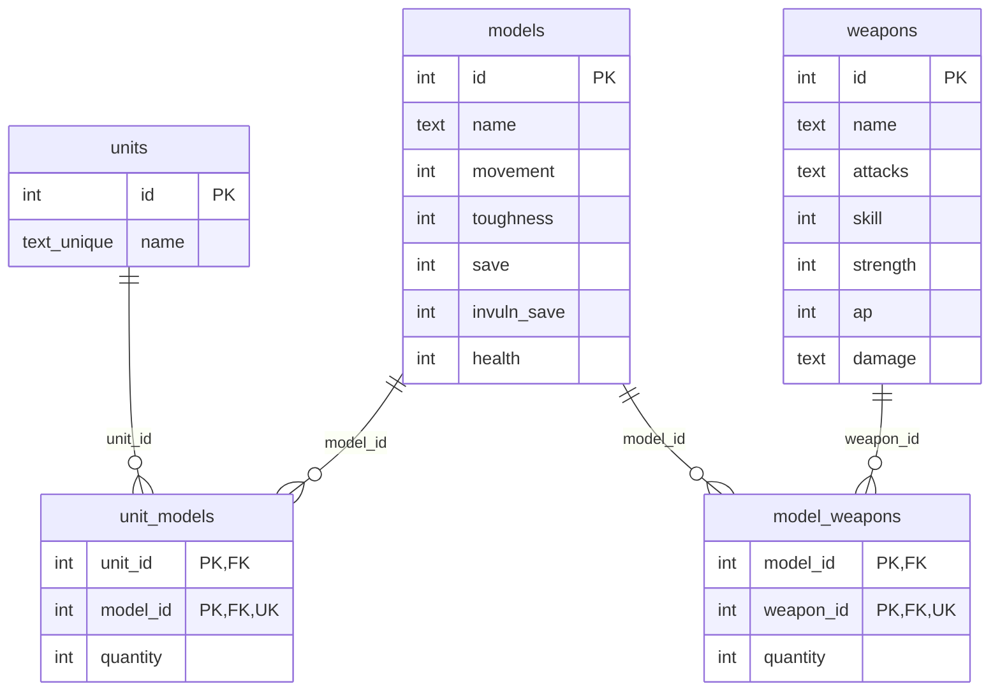
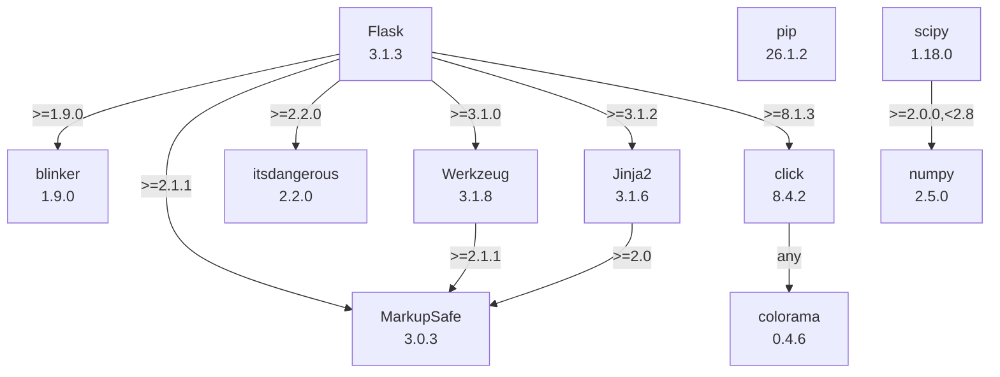

# TTWargame_Analyzer

A tool for visualizing and analyzing distributions of outcomes for tabletop wargames.

## Data Structures

### Regular Expressions

#### Dice roll or flat int value

```javascript
^\d+(?i:D\d+)?(\+\d+)?$|^(?i:D\d+)(\+\d+)?$
```


## Endpoints

- /
- /home
- /tests/plot
- /tests/weaponStats

## Running the app

Initializing the Database:
`flask --app flaskr init-db`

Standard:
`flask --app flaskr run`

Debug Mode:
`flask --app flaskr run --debug`

Hosted on <http://127.0.0.1:5000/>

## TODOs

- handle model/unit abilities which affect weapon stats and offensive rolls
- record model/unit keywords in the DB
- handle weapon keywords affecting offensive rolls (blocked by model/unit keywords)

- rework record deletion via frontend to use DELETE requests instead of GET

## Ideas

- Use strategy patterns to represent abilities, weapon keywords, etc.
- Use factory patterns to instantiate weapons, models, units, etc from user inputs.

- Think of the system as an assembly line, creating distributions to match user specifications

- Use PyQt6 for GUI (due to licensing)

- Use Openhammer API for creating units, models, and weapons instead of (or as an optional alternative to) user-input stats

## Database Structure



## Dependencies


